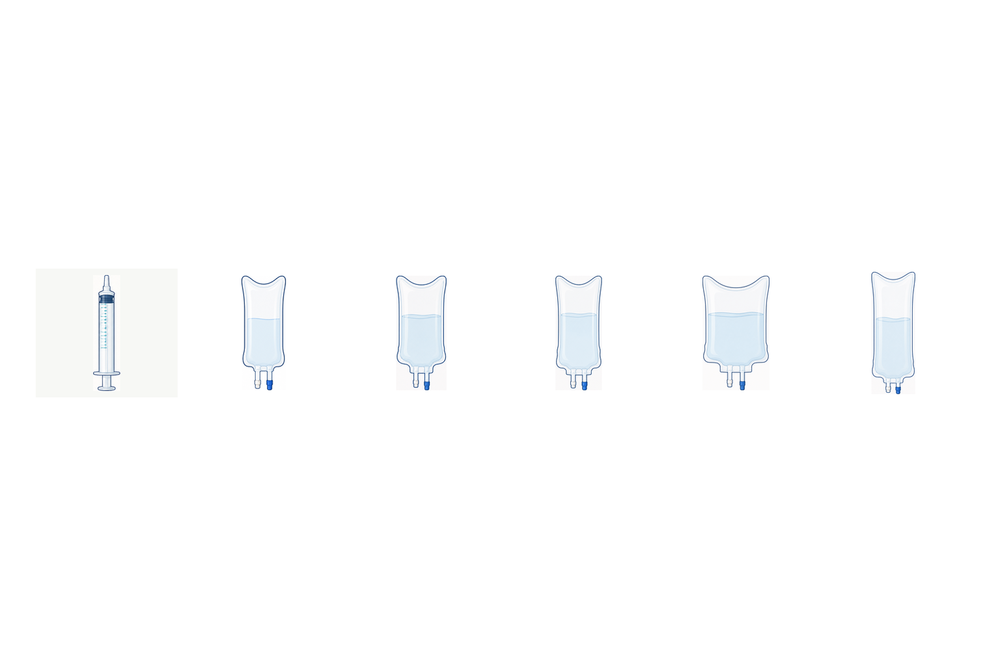
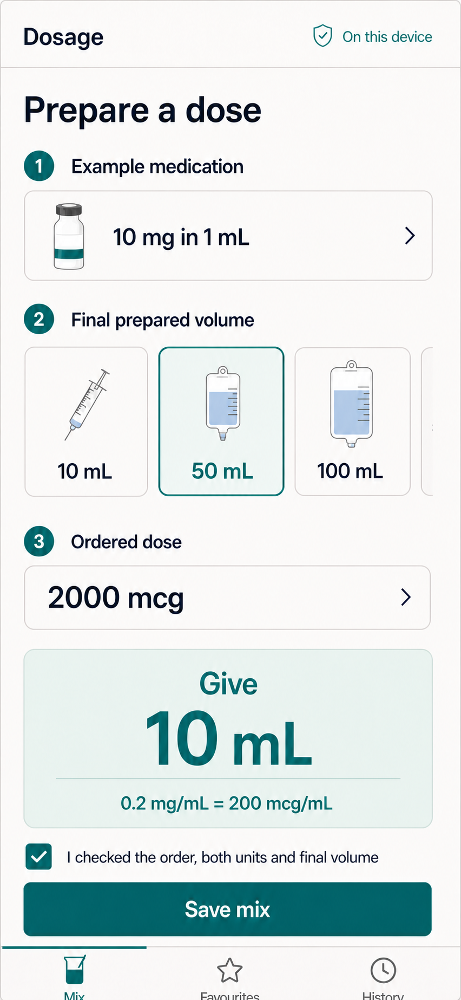
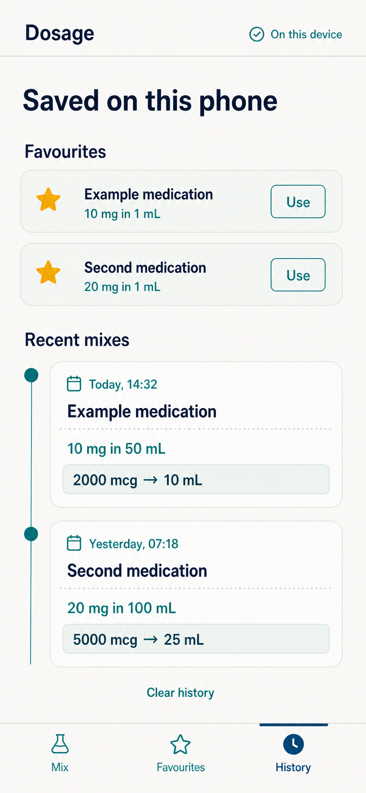

# MVP UX design

## Design objective

Make the correct calculation easy to inspect and a wrong input difficult to overlook. The experience is optimized for a 393×852 phone, one-handed scanning, interruptions, and fast return to context. The primary calculator fits in the available viewport without document or panel scrolling. Navigation—not swiping through a long form—moves between the calculator, saved records, and equation-review steps.

## Information architecture

The persistent bottom navigation has three destinations:

- **Mix** — start or resume the current unsaved calculation;
- **Favourites** — manage medication label facts and begin a fresh calculation;
- **History** — review or delete saved calculations on this phone.

The header always shows the product name and a visible “On this device” status. A prototype or unvalidated build also shows a non-dismissible “Not for patient care” banner.

## Primary flow

### 1. Medication

The first section asks for medication name, amount in the vial, vial unit, and vial volume. Field labels remain visible after entry. Example placeholders are never saved as real data. Loading a favourite fills only this section and clears the ordered dose and verification checkbox.

### 2. Final prepared volume

Six image cards show a 10 mL syringe and 50/100/250/500/1000 mL IV bags. The selected card has a high-contrast border, tinted background, check state, and `aria-pressed="true"`; selection never relies on colour alone.

Copy directly below the cards says: “Choose the total final volume after the medication is added. Verify bag overfill and preparation method under local policy.”

### 3. Ordered dose

The label is always “Ordered dose,” with its own unit selector. For a vial in mg or mcg, the order may independently use mg or mcg; a common path is a vial in mg and an order in mcg. For a vial in units, the order must use units. Changing either selector clears the dose and confirmation. There is no suggested value, recent-dose chip, or dose saved in a favourite.

### 4. Result and verification

When all inputs are valid, the fixed calculator shows the calculated administration volume beside a “Review calculation” action. That action opens a modal review sheet with one readable KaTeX equation at a time:

1. vial concentration: _A ÷ Vv = Cv vial-unit/mL_;
2. prepared concentration: _A ÷ Vf = Cp vial-unit/mL_;
3. explicit conversion when required: _Cp mg/mL × 1000 = Cpd mcg/mL_;
4. full substituted equation: _D ordered-unit ÷ Cpd ordered-unit/mL = Va mL_.

Tabs and Previous/Next controls expose the sequence without scrolling. Each view repeats the result and the local rounding-policy reminder. Closing the sheet returns focus to the review action.

The save action remains disabled until the clinician checks: “I checked the order, vial unit, ordered-dose unit, and final prepared volume.” Editing any critical value clears that acknowledgement. Saving is not required to use or dismiss a result.

## Generated design mockups

These generated images establish hierarchy, density, and visual tone. They are not validated clinical interfaces and the implemented text/values remain the source of truth.

### Prepare a dose

### Favourites and recent mixes

## Key states

### Empty

No result card is shown. The main action is “Calculate,” but results may update live after the first complete valid entry if testing demonstrates that live updates do not mask input mistakes.

### Incomplete

Incomplete fields show neutral helper text, not a red error while the user is still typing. On calculate/blur, focus moves to the first incomplete field and a concise error summary links to it.

### Blocking error

The result area is replaced—not merely covered—by a red-outlined error message with a plain-language correction. Example: “Ordered dose is greater than the medication available in one vial.” Previously calculated mL is removed from the accessibility tree.

### Valid, unconfirmed

The result is visible with a teal-neutral treatment. The save button is disabled and the acknowledgement is unchecked.

### Saved

A short inline confirmation says “Saved on this phone.” It does not imply cloud backup. The current calculation remains visible until the user chooses “New mix.”

### Storage unavailable or corrupt

Calculation continues because persistence is secondary. Favourites/history are disabled with: “This browser cannot save records. Your calculation still works.” Corrupt records are isolated; they never populate the form.

### Offline

No warning is needed when the installed app is healthy offline. The header continues to say “On this device.” If required app assets are unavailable, the app shows a bundled recovery page and never falls back to a remote site.

## Favourites

A favourite card contains name, medication amount/unit, vial volume, “Use,” edit, and delete. One card is shown at a time with Previous/Next paging so saved content never creates a scrolling page. “Use” opens a fresh mix with no ordered dose. Duplicate names are allowed because concentration disambiguates them, but an exact duplicate prompts before saving.

Never use look-alike/sound-alike colour coding or infer a drug identity. Names are user-entered display labels only.

## History

Each history card shows local date/time, medication label, vial label facts, final volume, ordered dose, prepared concentration, and calculated mL. Newest is first, with one card at a time and explicit Previous/Next paging. No patient or order identifier appears.

Deletion is available per record. “Clear history” requires a confirmation that states the scope and lack of recovery. Reopening a record is called “Review,” not “Repeat,” and never carries forward acknowledgement.

## Content rules

- Say “vial amount,” “vial volume,” “final prepared volume,” “ordered dose,” and “calculated volume.”
- Always put a space between value and unit: `10 mg`, `1 mL`.
- Use a leading zero for values below one: `0.2 mg/mL`, never `.2 mg/mL`.
- Do not add trailing zeros that imply false precision: `2000 mcg`, not `2000.0 mcg` unless entered and clinically meaningful.
- Never silently normalize the ordered dose to the vial unit; show both the original ordered unit and the converted concentration.
- Never abbreviate “units” to `U`.
- Avoid “safe,” “correct,” “recommended,” “usual,” or “standard dose.”
- A visual container is supportive; its adjacent text value is authoritative.

## Visual system

- Canvas: warm off-white `#f7f8f5`.
- Primary ink: deep navy `#102a43`.
- Selected/verified: teal `#087f7a` plus border/icon treatment.
- Result surface: pale mint `#e8f4f1`.
- Caution: amber `#9a6700` with icon and text.
- Blocking error: deep red `#b42318` with icon, summary, and field association.
- Body type: bundled humanist sans-serif with tabular numerals; no remote fonts.
- Entered values and essential instructions use at least 16 CSS px; condensed persistent labels use at least 12 CSS px; the critical result is at least 44 px.
- Minimum target: 44×44 CSS px with 8 px separation.
- Cards use borders and spacing, not shadows as the only boundary.

## Accessibility and interruption recovery

- Meet WCAG 2.2 AA contrast, semantics, reflow, focus, target-size, and error-identification requirements.
- Keep document and dialog dimensions at or below the viewport at 393×852 and 320×852; E2E tests fail on horizontal or vertical overflow.
- Use native inputs, radio/button semantics, headings, and an ordered reading sequence.
- Announce a newly valid or newly invalid result once with a polite live region; do not announce on every keystroke.
- Keep unit labels programmatically associated with their values.
- Support keyboard, switch control, screen readers, 200% text zoom, reduced motion, portrait, and landscape.
- Preserve an unsaved draft locally on input, but show “Unsaved draft on this phone” after interruption and clear acknowledgement on resume.
- Never use vibration, sound, animation, or colour alone to communicate safety state.

## Formative usability tasks

Representative clinicians should complete at minimum:

1. calculate 2000 mcg from 10 mg/1 mL at a final 50 mL volume;
2. explain why the result is 10 mL from the displayed equation;
3. notice and correct confusion between adding 50 mL and preparing to a final 50 mL;
4. reject an ordered dose exceeding one-vial contents;
5. save and reuse a favourite without reusing the prior dose;
6. resume after an interruption and notice that acknowledgement was cleared;
7. find and delete a local history item;
8. explain what “On this device” does and does not promise.

Critical errors include accepting the wrong unit, wrong final volume, wrong ordered dose, or wrong calculated mL; treating a favourite/history item as an authorized order; or believing the app provides a clinical dose recommendation.
