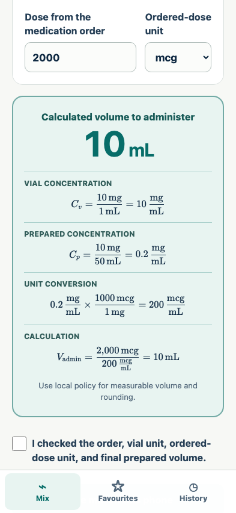

# Dosage

Dosage is a phone-first, local-only dilution calculator for clinicians preparing medication from a concentrated vial. A clinician enters the medication amount and vial volume, chooses the **final prepared volume**, enters an already-prescribed dose, and receives the calculated volume to administer.

> **Prototype only — not for patient care.** This repository has not completed clinical validation, human-factors validation, security review, or medical-device regulatory assessment. The app must not be used to choose a dose. Every result must be checked against the medication order, product label, pharmacy guidance, and local policy.

The current repository contains:

- a basic Svelte SPA with a working dilution calculation;
- locally stored medication favourites and calculation history;
- generated illustrations for the 10 mL syringe and 50/100/250/500/1000 mL bags;
- product, MVP, and UX design documents;
- an explicit future E2E strategy based on `../food` and `../games/jaipur`.

## Current PR preview

The calculation review uses locally bundled KaTeX to show dimensional analysis and accessible MathML. No equation, font, or input is fetched from a third party.

The calculator is a fixed-height phone interface with no page or panel scrolling. It defaults the vial unit to mg, vial volume to 1 mL, and ordered-dose unit to mcg while leaving medication amounts, doses, and final prepared volume unset. The answer stays hidden until every detailed, single-line equation is individually checked and the review is completed. Its flexible IV-bag illustrations preserve the distinct real-world silhouettes, including a visibly broader 500 mL bag. Saving the entered vial facts as a favourite immediately fills the main-screen star; favourites and history use explicit paging.



## Calculation model

The MVP keeps the vial unit and ordered-dose unit separate. Compatible mass units are converted explicitly before division:

```text
prepared concentration = medication amount in vial / final prepared volume
converted concentration = prepared concentration expressed in ordered-dose units
volume to administer = ordered dose / converted concentration
```

Example: 10 mg in a 1 mL vial, brought to a **final prepared volume** of 50 mL, for an ordered dose of 2000 mcg:

```text
prepared concentration = 10 mg / 50 mL = 0.2 mg/mL
converted concentration = 0.2 mg/mL × 1000 = 200 mcg/mL
volume to administer = 2000 mcg / 200 mcg/mL = 10 mL
```

“Final prepared volume” is deliberate wording. A labelled 50 mL bag is not always exactly a final volume of 50 mL after medication is added. Bag overfill, medication volume, displacement, and local preparation policy must be resolved by the clinician or pharmacy outside the app.

## Run locally

Requirements: Node.js 20 or newer.

```bash
npm install
npm run dev
```

Then open the local URL printed by Vite. Production output is created with:

```bash
npm run check
npm run build
npm run test:e2e
```

`npm run test:e2e:update-snapshots` deliberately refreshes the zero-diff visual baselines and their generated scenario walkthroughs.

Pull requests run the full Playwright suite before deploying to `https://anicolao.github.io/dosage/pr<PR number>/`. The workflow preserves other previews on the `gh-pages` branch and updates a bot comment on the PR with its URL.

The prototype has no analytics, account, API, remote font, CDN, or network-writing code. Favourites and history use browser `localStorage`. The current basic build does not yet include an installable service worker; offline-after-install support is an MVP requirement, not a claim about this prototype.

## Documentation

- [VISION.md](./VISION.md) — product purpose, principles, boundaries, and success criteria
- [MVP_DESIGN.md](./MVP_DESIGN.md) — requirements, calculation rules, data model, risk controls, and E2E plan
- [MVP_UX_DESIGN.md](./MVP_UX_DESIGN.md) — information architecture, flows, states, accessibility, and generated mockups

## Privacy promise

No patient identifiers are requested or needed. All user-created content must remain on the device. The shipped MVP must enforce this with a restrictive Content Security Policy, no remote dependencies, no telemetry, and E2E tests that fail on any unexpected network request. Clearing site data removes the records; there is no cloud recovery.

## Reference testing approach

The planned test harness combines [food’s unified screenshot/documentation steps](../food/E2E_GUIDE.md) with [Jaipur’s deterministic multi-viewport checks](../games/jaipur/playwright.config.ts) and its layout-safety assertions. See [MVP_DESIGN.md](./MVP_DESIGN.md#end-to-end-testing-strategy) for the complete scenario and test-vector plan.

## Regulatory and safety note

Intended use determines whether clinical software is regulated. Before any clinical deployment, obtain qualified regulatory advice in every target jurisdiction and complete formal risk management, verification, validation, and representative-user usability testing. Current reference points include Health Canada’s [SaMD definition and classification guidance](https://www.canada.ca/en/health-canada/services/drugs-health-products/medical-devices/application-information/guidance-documents/software-medical-device-guidance-document.html), the FDA’s [Clinical Decision Support Software FAQ](https://www.fda.gov/medical-devices/software-medical-device-samd/clinical-decision-support-software-frequently-asked-questions-faqs), and its [human-factors guidance](https://www.fda.gov/regulatory-information/search-fda-guidance-documents/applying-human-factors-and-usability-engineering-medical-devices).

## License

This project is licensed under the [GNU General Public License v3.0](./LICENSE).
