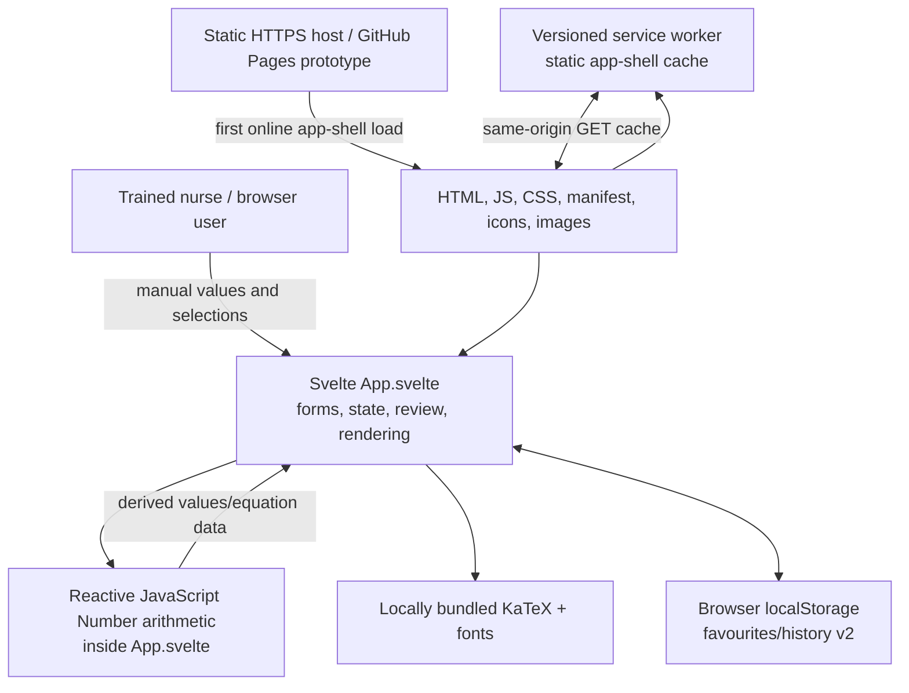

# ARC-001 — Architecture and data flow

| Field | Value |
| --- | --- |
| Record ID | ARC-001 |
| Status | Draft — current-state description plus unapproved target controls |
| Owner | Software lead (unassigned) |
| Required reviewers | Security/privacy lead, quality lead, regulatory lead |
| Repository base | `552fa8236480e8fa2f850850eeb513bd98a512c9` |
| Draft version/date | 0.1 / 2026-08-07 |

## 1. Current component view



The current safety-critical parsing, calculation, display preparation, review
state and persistence orchestration are concentrated in `src/App.svelte`.
`vite.config.js` injects package version/source revision and generates a service
worker containing a complete static-file list at build time.

## 2. Target separation

```mermaid
flowchart LR
  Raw[Raw input strings] --> Parser[Typed strict decimal parser]
  Parser --> Domain[Pure exact calculation + closed mg/mcg units]
  Domain --> Result[Discriminated validated result]
  Result --> Format[Approved display/equation model]
  Format --> UI[Presentation + review-state machine]
  UI <--> Repo[Versioned storage repository]
  Repo <--> DB[Approved local browser store]
```



CALCULATION_ENGINE_PLAN.md and later G2 records govern this target. The target
does not exist yet and may not be implemented until CALC-001 and DEV-001 are
approved.

## 3. Trust boundaries

| Boundary | Untrusted/input side | Controlled side | Required control |
| --- | --- | --- | --- |
| Human input | Keyboard/touch, copied text, selected values | Domain parser | Closed grammar, bounds, unit type and complete validation |
| Browser persistence | Missing, corrupt, stale, future or modified records | Storage schema/repository | Versioned schema, validation, migration/quarantine, recomputation |
| Build supply chain | npm registry, tools, actions, source changes | Release artifact | Locks, SBOM, reviews, least privilege, provenance and artifact digest |
| Static host/network | Mutable host, offline cache, failed/partial update | Approved installed release | CSP, same-origin allowlist, atomic cache/update, rollback and recall controls |
| Presentation | DOM/CSS/font/browser/accessibility behavior | Nurse's interpretation | Supported matrix, reflow, semantic output and human-factors validation |
| Local device | Other users, OS/browser storage, eviction/loss | User-created local records | Managed-device policy, disclosure, retention/deletion and no patient fields |

## 4. Data inventory and flow

### 4.1 Calculation-session data

Medication display name, vial amount/unit/volume, final prepared volume and
ordered dose/unit exist in browser memory. Current arithmetic derives
concentrations, equations and administration volume. No server receives them.
The target engine will preserve admitted input text and return a validated
structured result; formatted text will never be authoritative.

### 4.2 Persisted data

The current app uses two origin-scoped `localStorage` keys:

- `dosage.favourites.v2`; and
- `dosage.history.v2`.

Favourites contain medication display/vial facts. History also contains entered
calculation facts and derived numeric values. These records are neither
encrypted by the app nor cloud-backed and disappear when the browser removes
site data. Current reads parse JSON but do not enforce an approved schema. The
target may use IndexedDB or another approved local store only after STO-001;
changing technology does not change the local-only privacy boundary.

No patient, clinician, facility, room, encounter, order identifier or free-text
clinical note field is intended or currently exposed.

### 4.3 Runtime network

The app has no application API, remote font, CDN, analytics, telemetry, crash
upload or cloud synchronization. Initial installation and updates retrieve the
static app shell from the configured HTTPS origin. The generated service worker
handles same-origin GET requests inside its scope and caches static responses.

Current E2E instrumentation provides partial evidence of local operation and a
dedicated offline flow, but the target WebSocket/EventSource/request allowlist,
CSP and all failure/update paths are not complete. Absence of an application
backend does not itself prove the runtime network boundary.

## 5. Build and deployment path

```text
Git source + package.json/package-lock.json
        │ npm ci / controlled Node and tools
        ▼
Vite/Svelte build with DOSAGE_GIT_HASH + PUBLIC_BASE_PATH
        │
        ├─ hashed JS/CSS/font assets
        ├─ index.html + manifest + icons/images
        └─ generated versioned service-worker cache manifest
        ▼
static HTTPS host → first online load/install → origin-scoped browser cache
```

Current CI runs verification and deployment in one workflow with repository
write permissions, and GitHub Pages previews are public/mutable. SEC-001 and the
H3 remediation must separate untrusted verification from privileged deployment
and define a controlled clinical channel. GitHub Pages is not that future
channel.

## 6. Medical-device signal and integration statement

No current source or configuration exposes barcode, camera, microphone, OCR,
Bluetooth, serial, WebUSB, WebHID, EHR, pharmacy system, infusion pump,
physiologic monitor, IVD analyser, PACS/image or other signal-acquisition input.
All clinical quantities are entered or selected by the user. There is no
runtime backend to ingest them indirectly.

Before submission, verify this statement by approved source/configuration
inventory and a built-artifact/network/interface test. Any future integration
reopens REG-001, REG-003, SYS-001, risk management and classification.

## 7. Current gaps affecting the architecture claim

- calculation and storage are not separated typed domains;
- arithmetic uses permissive JavaScript Number behavior;
- persisted records lack schema validation/migration;
- restrictive CSP is absent;
- CI permissions and release provenance are incomplete;
- cache update/rollback/eviction/recall behavior is not fully controlled; and
- supported-browser/device and accessibility evidence is incomplete.

## Approval

| Role | Name | Decision | Date/signature |
| --- | --- | --- | --- |
| Software lead | Unassigned | Pending | — |
| Security/privacy lead | Unassigned | Pending | — |
| Regulatory lead | Unassigned | Pending | — |
| Quality lead | Unassigned | Pending | — |
