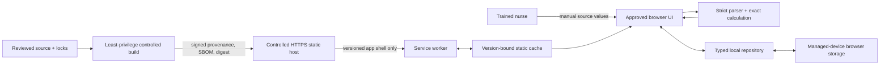

# SEC-001 — Security and privacy plan

| Field | Value |
| --- | --- |
| Record ID | SEC-001 |
| Status | Draft — unapproved; G0/G1/G2 open; controls are not implemented evidence |
| Owner | Security/privacy lead (unassigned) |
| Required approvers | Software lead, quality lead, regulatory lead, legal manufacturer, pilot-institution privacy/security authorities |
| Target | `0.2.0-classification` reference product and its controlled delivery lifecycle |
| Source baseline | `f6e903a08f45` (record must be rebased to the approved G1 baseline) |
| Draft version/date | 0.1 / 2026-08-07 |

This plan refines SEC-001 through SEC-005, PRV-001/PRV-002 and AVL-001 through
AVL-005. It is a proposed G2 design input, not a cybersecurity report, privacy
impact assessment, penetration-test result or release authorization. Canadian
privacy duties depend on the institution, jurisdiction, roles, deployment and
contracts; those reviews cannot be replaced by this repository record.

## 1. Scope, objectives and security claims

The plan covers the browser app, calculation integrity boundaries, local
records, app-shell service worker and cache, static host, build dependencies,
GitHub/Nix/npm tooling as applicable, CI, release artifacts, vulnerability
maintenance and incident coordination.

The proposed security objectives are:

1. **Calculation integrity:** only reviewed source, approved code and local
   assets can influence a calculation or its displayed equations.
2. **Record integrity and confidentiality:** sensitive local context is
   minimized, schema-validated, isolated from app-shell caching and protected by
   approved device controls.
3. **Availability with safe failure:** an installed approved shell supports the
   defined offline workflow; partial update, eviction or corruption does not
   silently present an unapproved mixture of versions.
4. **Release authenticity and traceability:** visible version/revision, source,
   lockfiles, tools, SBOM, artifact digest and deployment record agree.
5. **Network minimization:** the intended runtime has no API, account,
   analytics, telemetry, advertising, cloud sync, remote font/content or user-
   record transmission.
6. **Lifecycle response:** vulnerabilities and incidents are detected,
   safety-assessed, corrected and communicated through complaint/CAPA/reporting/
   field-action processes.

“Local-only” and “offline capable” shall not be used as synonyms for secure,
private or continuously available. GitHub Pages remains a public prototype
demonstration channel and is not the proposed controlled clinical channel.

## 2. Current architecture and evidence limits

ARC-001 records one Svelte/Vite static application, locally bundled KaTeX and
fonts, no application backend, two browser `localStorage` keys, and a generated
version-named app-shell service worker. The current privacy E2E case instruments
fetch, XHR and `sendBeacon`, asserts same-origin GET requests and verifies two
expected localStorage keys. The current offline case verifies one Chromium
install/restart/save/reload path.

Those are useful prototype controls but do not establish the target claim:

- WebSocket and EventSource are not denied/instrumented;
- the built artifact and every failure/UI state are not exhaustively inventoried;
- there is no production CSP;
- runtime/build/action dependencies are not represented in an approved SBOM;
- CI grants workflow-level `contents: write` and `pull-requests: write` and
  actions are tag-pinned rather than commit-SHA-pinned;
- cache install uses `addAll`, activation deletes every prior matching cache,
  and update/rollback/corruption/eviction are not controlled or tested; and
- vulnerability, penetration-test, disclosure, incident, release-signing and
  supported-platform monitoring processes are absent.

No current test shall be cited as proof of a control it does not exercise.

## 3. Security/privacy data flow and trust boundaries



Permitted network data is limited to static HTTPS request metadata and app-shell
bytes during first installation or update. Calculation source values and local
records shall not be placed in a URL, request, service-worker message, cache,
header, log, telemetry payload or support artifact. Hosting and CI providers may
process IP addresses, user agents, source/account metadata and access logs; the
privacy inventory, contracts and notices shall describe those flows accurately.

Trust boundaries and primary controls are:

| Boundary | Threat | Proposed control |
| --- | --- | --- |
| Manual input to domain | malformed/adversarial value; mg/mcg error | CALC-001 closed parser, typed units, bounds and verified result state |
| Browser record to repository | tampering, stale/future schema, sensitive disclosure | STO-001 validation, recomputation, migration/quarantine and managed-device policy |
| Source/dependency to build | malicious package/action/change or leaked secret | review, lock/integrity, allowlisted source, SHA pins, scans, isolated least privilege |
| Build to hosted artifact | wrong revision, modification or incomplete publish | reproducible build comparison, digest/provenance, protected release and deployment record |
| Host/service worker to browser | stale, partial, mixed or recalled assets | CSP, explicit static allowlist, atomic cache lifecycle, visible identity and rollback/recall process |
| Device/browser to other users/apps | local context disclosure or deletion | OS encryption/access control/MDM, minimization, short retention, wipe and fallback |
| UI to user interpretation | hidden warning/version/update failure | offline label/IFU, supported matrix, accessible status and human-factors validation |

## 4. Threat-model method and initial threat register

Before G2, the security/privacy and risk owners shall approve a threat-model
method and scoring bridge to RMF-001. STRIDE may organize technical threats, but
CVSS or likelihood alone shall not determine medical risk: every threat is also
assessed for erroneous preparation, delayed therapy, loss of availability,
privacy harm and foreseeable clinical response.

Assets include calculation source and result integrity, review-state integrity,
approved equations/labels/IFU, local records, source repository, credentials,
dependencies, build system, release artifact, cache/version status, deployment
registry and vulnerability/incident records. Threat actors include an
opportunistic web attacker, malicious/compromised dependency or contributor,
untrusted PR author, other device user, unauthorized same-origin content,
misconfigured host/institution and non-malicious corruption or update failure.

| Threat | Safety/privacy consequence | Required design/verification |
| --- | --- | --- |
| Modified source, package, action or artifact | wrong but plausible calculation or label | protected review, locks/SBOM, SHA pins, provenance/digest, independent calculation verification |
| Script/content injection | result/UI manipulation or record disclosure | restrictive CSP, no remote runtime dependency, output safety and qualified built-artifact security testing; penetration testing if required by the approved risk decision |
| Unexpected outbound channel | clinical-context disclosure | connect deny policy, API-constructor instrumentation, request allowlist and source/artifact inspection |
| Crafted local record | unsafe restored result, crash or persistent injection | STO-001 exact schema, no trusted derived data, safe rendering, record-level quarantine/fuzz tests |
| Partial/mixed cache update | equations/engine/IFU from different releases | atomic version manifest, full validation before activation, compatible DB migration, two-release testing |
| Stale/recalled release | known defect remains in clinical use | visible identity, institution/version registry, update/EOS/field-action procedure and fallback |
| Cache/storage eviction or quota failure | tool or history unavailable during task | detection, honest status/recovery label, managed-device policy and independent non-software workflow |
| Shared/lost/unmanaged device | local medication/dose context disclosed | no patient fields, short retention, OS access/encryption, MDM lock/wipe, institutional PIA/TRA |
| CI token/secret misuse | unauthorized deployment/source modification | default read-only permissions, privileged deploy isolation, protected environments and secret scanning |
| Denial of service or host outage | delayed preparation or unsafe improvisation | installed shell qualification, capacity/monitoring, institutional fallback; no first-visit-offline claim |

The approved model shall cover spoofing, tampering, repudiation/auditability,
information disclosure, denial of service and privilege escalation at each
boundary, then trace controls and residual risks into RMF-001/TRC-001.

## 5. Browser and network policy

### 5.1 Proposed network contract

- First installation and controlled update may issue HTTPS GET/HEAD requests
  only to the exact approved origin and release base path for listed static
  app-shell assets, manifest, service worker and version metadata.
- Calculation, validation, equation review, saving, deletion, favourites,
  history and error/recovery paths shall issue no application network request.
- `fetch`, XHR, `sendBeacon`, WebSocket and EventSource shall be denied unless a
  future approved requirement names the exact endpoint, method and data. No such
  endpoint is proposed for this release.
- No remote script, style, font, image, frame, media, worker, analytics, crash
  reporter or CDN is allowed. All required safety information is bundled.
- The service worker shall handle same-origin, in-scope static GETs only and
  shall not intercept, inspect or synthesize requests containing user records.
- Redirects, opaque responses, cross-origin assets, insecure HTTP and unlisted
  MIME types shall fail installation/update validation.

Tests shall separately inventory browser resource loading and application API
calls. “All observed requests were same-origin” is insufficient when an
unexpected same-origin endpoint could still receive record content.

### 5.2 Proposed CSP baseline

The controlled clinical host shall deliver an HTTP response-header CSP. The
starting policy is:

```text
default-src 'none';
base-uri 'none';
object-src 'none';
frame-ancestors 'none';
form-action 'none';
script-src 'self';
style-src 'self';
font-src 'self';
img-src 'self';
manifest-src 'self';
worker-src 'self';
connect-src 'none';
upgrade-insecure-requests
```

The software/security leads shall test this policy against Svelte, KaTeX,
service-worker installation/update and every supported browser. If KaTeX or
another required renderer needs inline styles, first remove or pre-generate the
need. Any unavoidable relaxation (including `'unsafe-inline'`, `data:` or a
same-origin `connect-src`) requires a directive-by-directive threat rationale,
approved risk, and a regression test proving no broader source is enabled.
`'unsafe-eval'`, wildcard sources and unapproved framing are prohibited.

GitHub Pages cannot be treated as the clinical control if it cannot deliver and
retain the approved headers. A meta-tag CSP may be defense in depth for the
prototype but cannot implement every header directive.

Also define `Referrer-Policy: no-referrer`, `X-Content-Type-Options: nosniff`, a
least-privilege `Permissions-Policy`, HSTS at the controlled HTTPS domain, and
cache headers that distinguish immutable hashed assets from update/version
metadata. Exact headers require supported-browser and hosting approval.

## 6. App-shell service worker, update and recovery

The release build shall generate one version manifest containing release
version, full source revision, base path, every app-shell URL, byte length,
MIME type and cryptographic digest. Cache identity shall be bound to this
manifest digest, not only a package version/short hash. User records and
runtime-generated clinical content shall never appear in the manifest/cache.

### 6.1 Atomic installation and activation

1. Install into a uniquely named staging cache without changing the active
   release.
2. Fetch every allowlisted asset, reject redirect/cross-origin/non-success/
   wrong-MIME responses, and verify every length/digest.
3. Reopen and verify the complete staged cache against the manifest.
4. Mark it eligible for activation only after all checks pass. A failed install
   deletes staging only and preserves the active worker/cache.
5. Activate under normal service-worker lifecycle control after compatibility
   checks; do not interrupt a calculation or force `skipWaiting` without an
   approved user-state design.
6. Route one client to one complete release. HTML, engine, styles, fonts, label
   and IFU shall never be selected independently from different cache versions.
7. Retain the prior approved cache for the approved rollback window until the
   new release passes post-activation health checks; then remove obsolete
   caches deterministically without touching unrelated origins/scopes.

### 6.2 Rollback, database compatibility and recall

Each release shall declare compatibility with current and immediately prior
STO-001 database/equation versions. A rollback may activate a retained approved
shell only when it can safely read the existing storage, otherwise it shall
enter a labelled read-only/recovery state and require controlled support. No
rollback shall silently down-migrate or discard records.

Operational rollback/recall requires a controlled prior artifact, digest,
deployment authorization, institution/version registry, user communication,
effectiveness confirmation and non-software clinical fallback. An offline
client cannot be assumed to receive a remote recall. End-of-support and recall
design shall avoid disabling the tool during a task without a safe alternative.

### 6.3 Eviction, corruption and offline behavior

The app shall distinguish cache readiness from local-record availability.
Missing/corrupt cache assets, storage eviction, quota exhaustion, service-worker
registration failure and browser private mode require explicit tested states.
The UI shall not display “offline ready” until the exact complete release is
verified. If recovery needs a network, the message shall say so and direct the
user to the institution's approved fallback; it shall not claim that local
records can be restored by the manufacturer.

Required tests include fresh first visit offline (expected unavailable), first
online install, close/reopen offline, failed/partial update, two successive
versions, activation with an open calculation, rollback, corrupt/missing asset,
Cache Storage eviction, local-database eviction independently, quota failure,
service-worker removal and online recovery on every approved device/browser.

## 7. SBOM, dependencies and provenance

Every release shall produce a machine-readable CycloneDX or SPDX SBOM and a
reviewable summary. It shall cover direct/transitive runtime and build packages,
bundled fonts/media/icons, service-worker/build plugins, Node/Nix inputs as
appropriate, and separately inventory GitHub Actions and release tooling. For
each component record exact version/commit, source, supplier, scope, integrity
hash, licence, modification status and current known-vulnerability assessment.
Unknown licence/source/vulnerability status blocks release disposition rather
than becoming blank text.

Supply-chain controls shall include:

- committed `package-lock.json` and `npm ci`; no floating install in release;
- an approved Node version and, where used, locked Nix inputs with the
  relationship between Nix-provided tools and `package.json` dependencies
  documented;
- reviewed registry/source allowlists and npm integrity verification;
- no install scripts unless individually justified and sandboxed/reviewed;
- direct dependency and transitive-change review, licence/IP review and
  dependency minimization;
- GitHub Actions pinned to reviewed full commit SHAs;
- default workflow `contents: read`, isolated unprivileged PR verification, and
  write permission only for a protected deploy job/environment;
- branch protection, required reviews, protected secrets and no secret access
  for untrusted fork code;
- dependency review, static analysis and secret scanning as release-blocking
  according to approved severity rules; and
- archived source, lockfiles, tool versions, SBOM, build log, artifact, digest
  and signed/attested provenance for the exact displayed revision.

Reproducibility shall be tested by two clean builds in controlled independent
workspaces. Any expected nondeterministic bytes shall be identified and removed
or excluded by an approved semantic comparison; an unexplained artifact
difference is an anomaly. The deployed artifact digest and visible package/
source identity shall match the release record.

## 8. Vulnerability management and security maintenance

Before clinical release, establish a monitored English/French vulnerability
intake contact, coordinated-disclosure policy, authorized security-testing
boundary, component/browser/OS monitoring sources, triage roster and after-hours
safety escalation. The manufacturer remains accountable when a supplier or
institution operates part of the channel.

Every report or automated finding shall receive an identifier and record:
affected component/releases/institutions, reproducibility, exploitability,
exposure, privileges/user interaction, calculation/availability/privacy impact,
medical risk link, active exploitation, compensating controls, regulatory/
privacy reportability, remediation decision, verification, communication and
closure approval.

Proposed service targets, requiring quality/security approval, are:

| Condition | Initial action target | Remediation/decision target |
| --- | --- | --- |
| Suspected active exploitation or possible calculation-integrity compromise | Immediate safety escalation; containment decision within 24 hours | Field-action/update timing set by patient risk; daily accountable review until controlled |
| Critical technical severity or critical/high medical risk | Triage within 1 business day | Correct or formally contain within 7 calendar days; release only after affected verification |
| High technical severity without higher medical impact | Triage within 3 business days | Correct/contain within 30 calendar days |
| Lower severity | Triage within 10 business days | Risk-ranked maintenance release or documented acceptance with review date |

A calendar target never overrides a faster statutory, contractual, privacy-
breach, complaint or patient-safety response. Conversely, missing a target does
not permit silent risk acceptance. Temporary mitigation, update, rollback,
stop-use or channel restriction requires documented benefit-risk and
effectiveness verification.

Monitor the SBOM, supported browsers/OS, security guidance and hosting/build
services at an approved frequency and before every release. An independent
penetration test is proposed for the later clinical-release program and is not
automatically a prerequisite to the classification question. Before G6,
security and quality shall either require it earlier based on risk or approve a
documented classification-stage deferral. When performed, its scope shall cover
CSP bypass/content injection, local-record tampering, service-worker scope/cache
poisoning/update failure, base-path separation and deployment/supply-chain
boundaries, with retest after correction.

## 9. Security incident, complaint and breach integration

A security event that can affect calculation integrity, availability, privacy
or release identity shall enter the same controlled intake as complaints and
incidents. The response procedure shall:

1. protect users and preserve a non-software workflow;
2. contain access/deployment while preserving forensic evidence and records;
3. identify exact versions, institutions and affected SBOM components;
4. assess patient harm, recurrence, privacy breach and Canadian reporting/
   field-action duties with quality, regulatory and privacy owners;
5. open CAPA/root-cause work where required;
6. issue version-matched English/French communication and update/rollback/
   stop-use instructions;
7. verify correction and field-action effectiveness; and
8. feed lessons into RMF-001, threat model, requirements, tests, SBOM monitoring
   and post-market surveillance.

The operational procedures and legally accountable contacts do not yet exist;
SYS-001 QMS-003 therefore remains open. Contact and statutory timing fields
shall be checked against current law and institutional agreements when the
procedures are approved and on each event, rather than copied uncritically from
this draft.

## 10. Privacy management plan

The data-minimized design shall be preserved, but local medication/dose/time
context and web access metadata may still be personal information. Before any
institutional deployment:

- appoint an accountable privacy officer and complete manufacturer and
  institution data inventories;
- determine custodian/controller, agent/service-provider and subcontractor roles
  and permitted purposes in each jurisdiction and contract;
- complete institution-specific privacy impact and threat/risk assessments,
  including Quebec/public-sector, access, location, logging and contracting
  requirements as applicable;
- use STO-001's no-patient-field, short-retention, deletion and migration design;
- approve managed-device encryption, authentication, auto-lock, browser data,
  backup, remote-wipe, device-loss and support procedures;
- configure hosting/access logs to the minimum approved content/retention/access
  and accurately disclose them; do not state “no personal information” solely
  because there is no application API;
- provide version-controlled, clinically reviewed English/French notices and
  in-product deletion information; and
- operate breach detection, containment, risk assessment, notification and
  recordkeeping under applicable federal, provincial/territorial and
  institutional requirements.

Accounts, remote support, exports, crash reporting, push, cloud sync, analytics,
EHR/pump/pharmacy integration or any manufacturer processing of calculation
content is outside this plan and triggers a new privacy/regulatory/security
project.

## 11. Verification and release evidence

VVP-001 shall define independent or qualified reviewers, controlled tools,
machine-readable reports, failure/anomaly handling and traceability. Minimum
security/privacy evidence is:

| Area | Required evidence |
| --- | --- |
| Network boundary | Instrument and deny fetch, XHR, beacon, WebSocket and EventSource; browser request allowlist by origin/path/method/type; source and built-artifact interface inventory across every workflow/failure state |
| CSP/headers | Automated header/directive assertions and supported-browser functional/negative tests; injection/security review; documented rationale for every relaxation |
| Local data | STO-001 schema/migration/corruption/privacy suite; prove no record content in request, cache, worker message, logs or generated diagnostics |
| Service worker | Manifest/digest inspection; incomplete/corrupt update; two-release activation; open-client behavior; DB compatibility; rollback; recall simulation; cache/database eviction and recovery |
| Supply chain | Validated SBOM, licences/sources, vulnerability scan, dependency-review record, SHA-pinned actions, least-privilege/fork test and secret/static-analysis reports |
| Provenance | Two clean builds, artifact comparison, digest/signature/attestation verification, displayed revision and deployed digest reconciliation |
| Threat controls | Approved threat-model review, malformed-record/input fuzzing and qualified independent security review/negative testing; independent penetration test and remediation retest if required before classification, otherwise a signed risk-based deferral to clinical-release work |
| Privacy | Data-flow inventory, PIA/TRA, hosting/log/config evidence, retention/deletion/device-loss tests and English/French notice review |
| Operations | Vulnerability/incident/rollback/recall tabletop with version/institution identification, communication, fallback and effectiveness checks |

Run network/offline tests in Chromium and WebKit plus the approved managed iOS
Safari and Android/Chromium combinations. Test a non-root release path. Any
unexpected network call, asset mismatch, unexplained build difference, unsafe
rollback, record disclosure, critical/high vulnerability, or any
penetration-test finding when a test is performed blocks G6/G7 until controlled
disposition. `npm audit` alone is not a cybersecurity conclusion.

Every control and result shall map through TRC-001 to RMF-001 hazards HZ-004,
HZ-008 through HZ-010, HZ-012 through HZ-014 and any newly identified hazards.
The security/privacy lead shall issue a release-specific cybersecurity report;
this plan is not that report.

## 12. Decisions and dependencies before approval

| Decision/dependency | Proposed direction | Owner | Status |
| --- | --- | --- | --- |
| Legal manufacturer/security/privacy accountability | Named Canadian manufacturer with operational response authority | Manufacturer | Open; G1 blocker |
| Clinical distribution/hosting | Controlled institutional channel; not GitHub Pages | Manufacturer, regulatory, security | Open |
| Supported devices/browsers | Managed iOS/Safari and Android/Chromium matrix | Software, security, clinical | Open |
| Exact CSP/headers | Deny-by-default policy in section 5 | Security/software | Open; implementation test required |
| Cache activation/rollback window | Complete staged cache plus one prior compatible release | Security/software/quality | Open |
| Release signing/attestation mechanism | Protected cryptographic provenance tied to artifact digest | Security/quality | Open |
| SBOM format/tool and vulnerability sources | CycloneDX or SPDX from locked build | Security/quality/IP counsel | Open |
| Registry/Nix/Node/action allowlists | Locked, reviewed sources | Software/security/quality | Open |
| Vulnerability targets/disclosure contact | Section 8 proposal | Security/quality/manufacturer | Open |
| Penetration-test timing | Perform before classification if risk requires; otherwise approve a specific deferral to later clinical-release work | Security/quality/manufacturer | Open; must be reconciled before G6 |
| App-layer encryption and managed-device controls | Decide per institutional threat model; do not rely on same-origin key | Privacy/security/institution | Open |
| Hosting logs/data roles/retention | Minimize and contract per institution/jurisdiction | Privacy/legal/institution | Open |
| Privacy/breach/incident procedures | Integrated operating processes | Privacy/quality/regulatory | Open |

G2 may approve requirements and planned verification only after conflicts with
CALC-001, STO-001, RMF-001, VVP-001 and DEV-001 are resolved. G6 requires the
implemented controls, release-specific SBOM/provenance/security report and
objective verification; this document alone cannot close either gate.

## Approval

| Role | Name | Decision | Date/signature |
| --- | --- | --- | --- |
| Security/privacy lead | Unassigned | Pending | — |
| Software lead | Unassigned | Pending | — |
| Quality lead | Unassigned | Pending | — |
| Regulatory lead | Unassigned | Pending | — |
| Legal manufacturer | Unassigned | Pending | — |
| Pilot-institution privacy/security authority | Unassigned | Pending | — |
