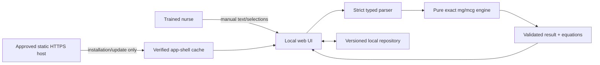

# 03 — Architecture and data flow

> **DRAFT — NOT SUBMISSION READY.** ARC-001 describes current and proposed
> states; this summary must be regenerated for the exact frozen build.

| Control field | Placeholder |
| --- | --- |
| Legal manufacturer / regulatory contact | `[TBD]` |
| Frozen source commit / build / artifact digest | `[TBD AT G8]` |
| Software and security/privacy approvals/signatures | `[TBD]` |
| French review | `[TBD OR APPROVED N/A RATIONALE]` |
| Current legal/guidance citations | `[TBD — regulatory verification]` |

## Proposed reference architecture

The classification reference is intended to accept manual input only and to
perform calculation locally. It has no runtime clinical backend, account,
analytics/telemetry service, drug/patient database, or signal/device interface.
First installation and controlled updates require the approved static host;
calculation and user-record operations are intended to issue no application
network request. These are target claims, not verified facts for a frozen build.

## Data and trust boundaries

- Raw human input crosses a parser boundary and must satisfy CALC-001.
- Browser records are untrusted on every read and must satisfy STO-001; derived
  results are recomputed rather than treated as authoritative stored facts.
- The package, dependency and hosting boundaries require SEC-001 provenance,
  CSP, same-origin, atomic update, rollback and recovery controls.
- UI rendering and accessibility remain safety-relevant presentation boundaries.
- Medication names and preparation history may reveal clinical context even
  without explicit patient identifiers.

## Evidence still required

Before finalization, reconcile this diagram to the frozen source and built
artifact; inventory every network/interface path; attach exact-build CSP and
zero-application-network results; approve the local-storage design; and identify
the supported deployment/browser matrix. See ARC-001, SEC-001, STO-001,
TRC-001 and the future VVR-001.
