# SUB-002 controlled screenshot evidence

This archive was captured automatically from Dosage `0.1.0` at source baseline `6b53fde87ff9b193b3c24f7bd93549746b4d6471`. It is evidence of prototype behavior, not clinical validation or authorization.

| Control | Value |
| --- | --- |
| Capture date | 2026-08-13 |
| Operator | Automated Playwright capture; no human operator |
| Environment | Playwright Chromium; en-CA; America/Toronto; 393x852 CSS pixels at device scale factor 1 |
| Worked example | Example medication; 10 mg in 1 mL; 50 mL final prepared volume; 2000 mcg ordered dose; expected administration volume 10 mL |
| Screenshot archive SHA-256 | `96251e9737a40a662d722778d565489ecf4f18753df6e74abe3968f9245778f8` |
| Built artifact file-manifest SHA-256 | `87394f7ba3170760d54004916cf3a79ebc1e56cf3c1982d573a8d9af625fe9db` |
| Machine-readable manifest | [MANIFEST.json](./MANIFEST.json) |

## Blank Mix screen and prototype identity

Initial Mix screen showing the persistent non-clinical warning, v0.1.0 · 6b53fde build identity, manual fields, closed final-volume choices and local-only navigation.

Workflow steps: 1, 2, 3, 4. PNG 393×852; SHA-256 `eece9cfdec376a22ef104e453d9b9bf7cea14a582e49a113b6f8a42d49913c8f`.

## Complete inputs with answer hidden

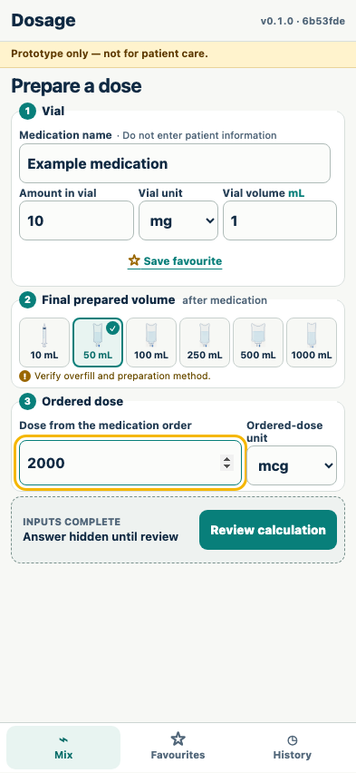

Worked-example inputs are complete, but no administration volume appears before equation review.

Workflow steps: 2, 3, 4, 6. PNG 393×852; SHA-256 `bb11ce9da750d7300d5f55b0fa9fb4becf6932b46bd6227e2f5cf35ac3004996`.

## Mandatory substituted-equation review

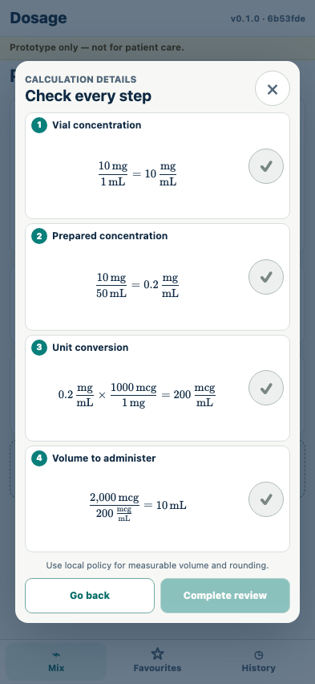

The review dialog displays vial, prepared, mg-to-mcg conversion and administration equations; every step must be checked before completion.

Workflow steps: 6. PNG 393×852; SHA-256 `34ac80e7975c02c2d921db899ec4d6f8ad61529e177fcb36fa6849bbe86e0adf`.

## Result revealed after completed review

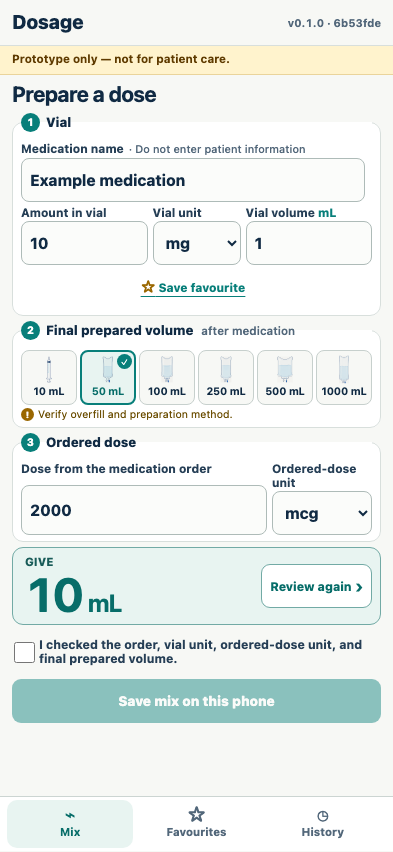

After all equations are checked, the prototype reveals 10 mL and requires a separate acknowledgement before history can be saved.

Workflow steps: 7. PNG 393×852; SHA-256 `92b5c93ba2ac9085317cce432bd7e2ef22da16ca9c184096cb7b69c028fbc518`.

## External-check acknowledgement

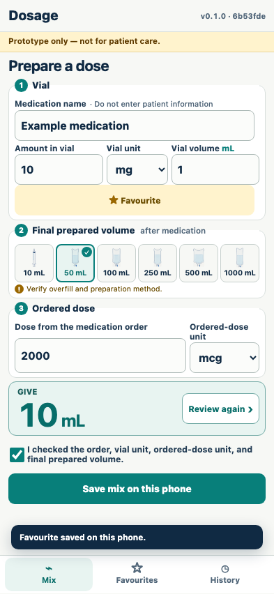

The user acknowledges checking the order, vial unit, ordered-dose unit and final prepared volume; the save action is then enabled.

Workflow steps: 7. PNG 393×852; SHA-256 `d4ecd4db1467a69a4886356c519f8afdfb9f7e26067518f0a9bea1827b9ba92e`.

## Order above one vial is blocked

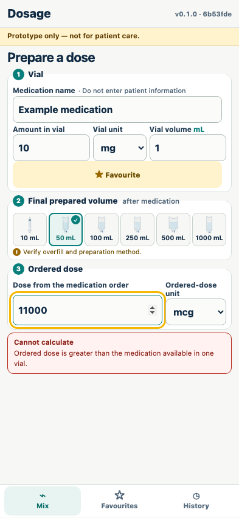

An ordered dose greater than the converted amount available in one vial produces a blocking error and no actionable result.

Workflow steps: 5. PNG 393×852; SHA-256 `4616744a701f3b62d0f38394b70f27e0f729aa1a1fe1c38683b3bea9e79dd068`.

## Final volume below vial volume is blocked

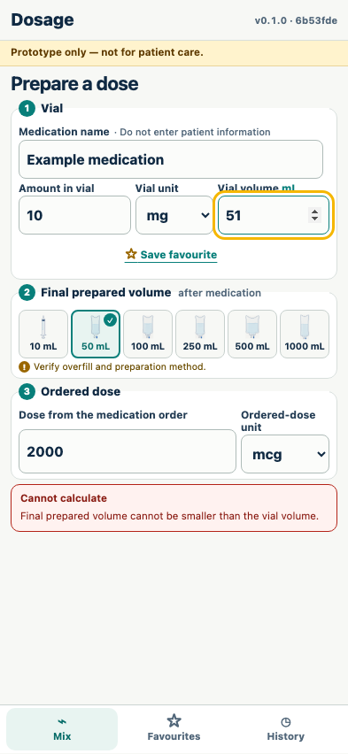

A 51 mL vial volume with a 50 mL final prepared volume produces a blocking error and no actionable result.

Workflow steps: 5. PNG 393×852; SHA-256 `c9fba3bb8755db9acca1b3e222af76e571af91554e5b7d6857d377cdb6fbde36`.

## Favourite stores vial facts only

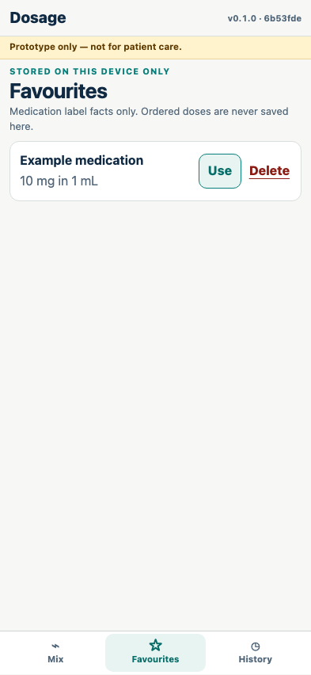

Favourites are labelled stored on this device only and retain medication/vial facts without an ordered dose.

Workflow steps: 8. PNG 393×852; SHA-256 `ebcdb29b19a39f2bcbd6628bd4e8ccc3875160d3a61cff8d54a6b299be558564`.

## Saved calculation in local history

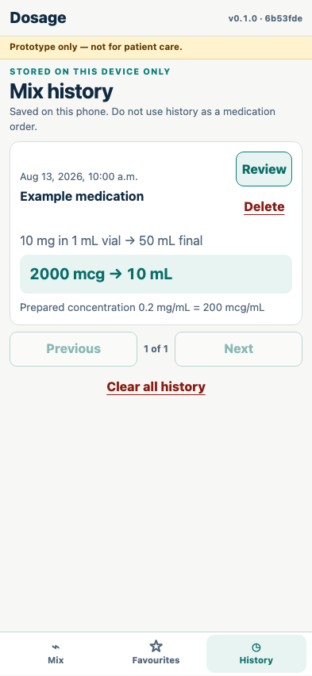

Mix history is labelled stored on this device only, warns that it is not a medication order, and displays the source inputs and result.

Workflow steps: 8. PNG 393×852; SHA-256 `ad91dd1b69af9b48c72776d7361af195b6c285c93ef5ad086289cc67ea687534`.

## History re-review resets equation checks

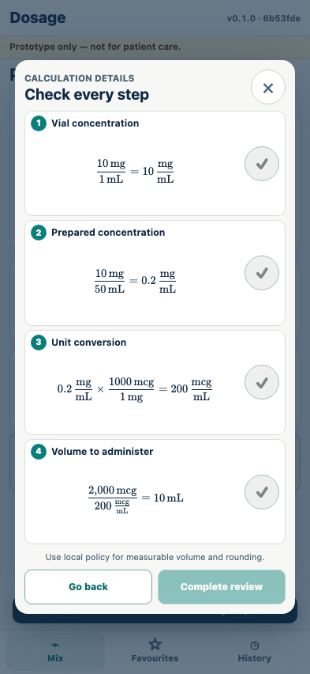

Opening a saved mix restores inputs into mandatory equation review with every check reset and the result concealed.

Workflow steps: 8. PNG 393×852; SHA-256 `0d3807ac653e630014514b5231c929d58bc9cc1a651f71d65516bb89c6d8b35d`.

## Corrupt local storage does not block calculation

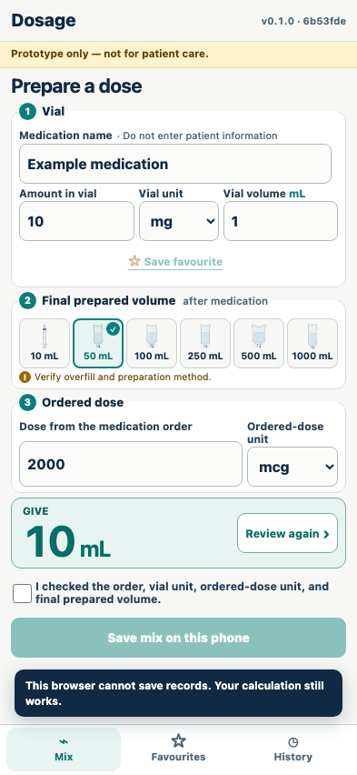

A corrupt favourites record disables persistence, displays a recovery warning and leaves the reviewed calculation available.

Workflow steps: 5, 8. PNG 393×852; SHA-256 `cd95fcf1fe7ae7115980d1d96d56521336944a54ebd0e675d9c0548f3fe9e1bc`.

## Installed app shell reopened offline

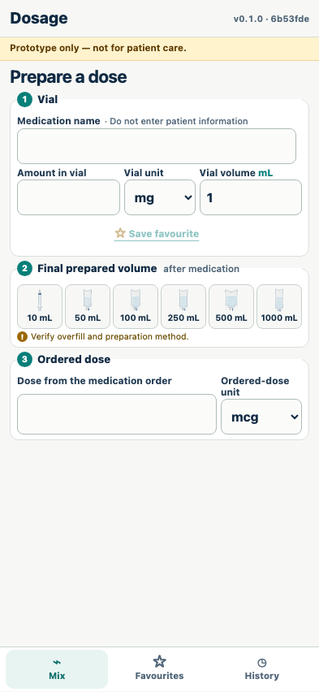

After a successful online app-shell installation and service-worker control, a new page opens offline with the prototype identity and calculator available.

Workflow steps: 1, 8. PNG 393×852; SHA-256 `eece9cfdec376a22ef104e453d9b9bf7cea14a582e49a113b6f8a42d49913c8f`.
