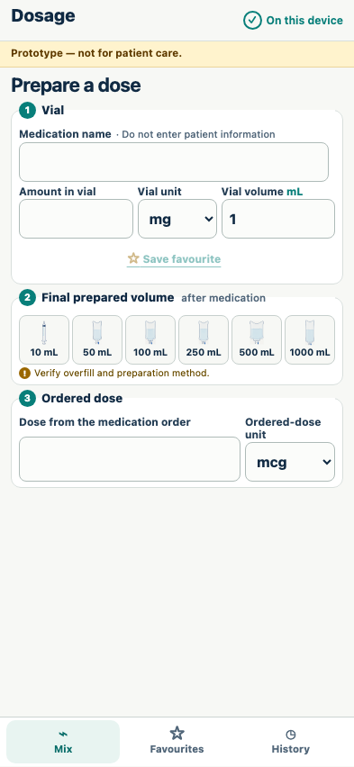
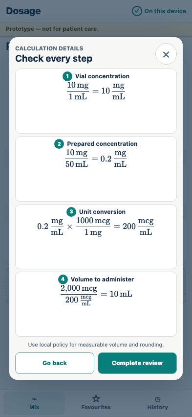
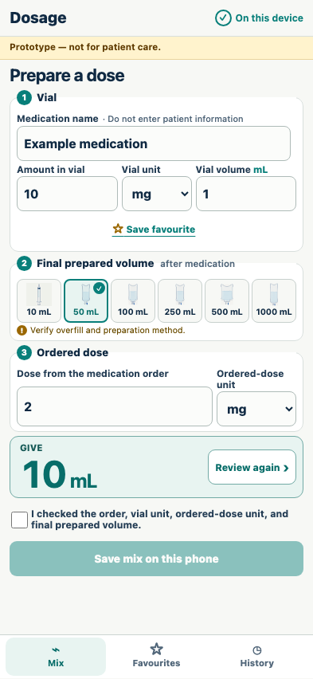
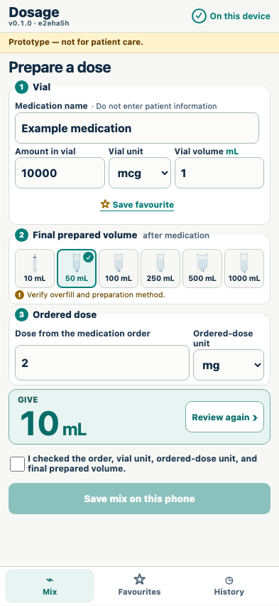

# Cross-unit calculation

A blank calculator gates its answer behind a simultaneous review of every substituted equation.

## Every medication, amount, unit, volume, container, and dose begins unselected

**Verifications:**

- [x] All text and numeric fields are blank
- [x] Neither unit selector nor any final volume has a default
- [x] No answer or review action is present for incomplete input

## All four large single-line equations fit together in one no-scroll review panel

**Verifications:**

- [x] Vial, preparation, conversion, and administration MathML are simultaneously visible
- [x] The mg-to-mcg factor and substituted 2000 mcg order remain explicit
- [x] Every equation is emitted as one uninterrupted KaTeX line
- [x] The review sheet and every equation fit without scrolling or clipping
- [x] The administration answer is still absent from the underlying calculator

## Completing review reveals the 10 mL administration volume

**Verifications:**

- [x] The vial is 10 mg in 1 mL and the order remains 2000 mcg
- [x] Only after completed review is the answer shown as 10 mL

## An equivalent order in mg produces the same answer after a fresh review

**Verifications:**

- [x] 2 mg also calculates to 10 mL
- [x] Changing the unit cleared the previous 2000 mcg value before entry

## The reverse mcg-to-mg conversion is equally explicit

**Verifications:**

- [x] 10000 mcg at 2 mg calculates to 10 mL
- [x] Changing any critical value required another completed review
