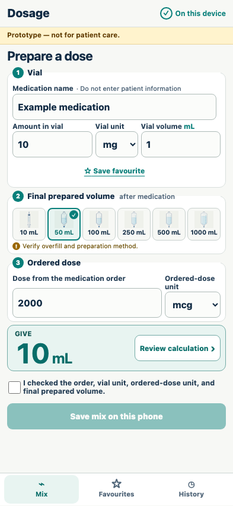
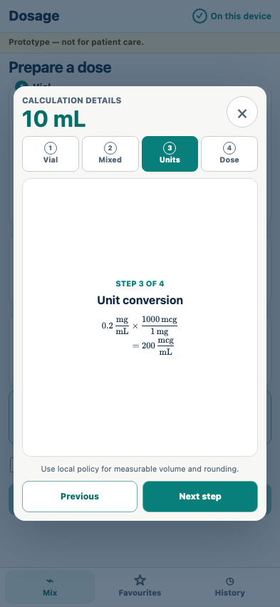
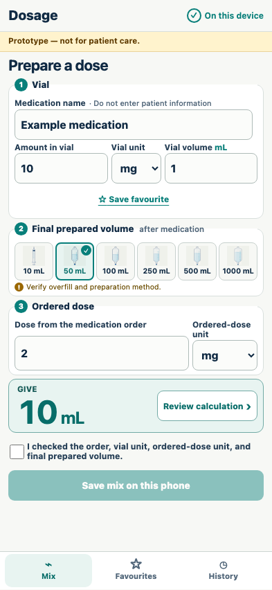
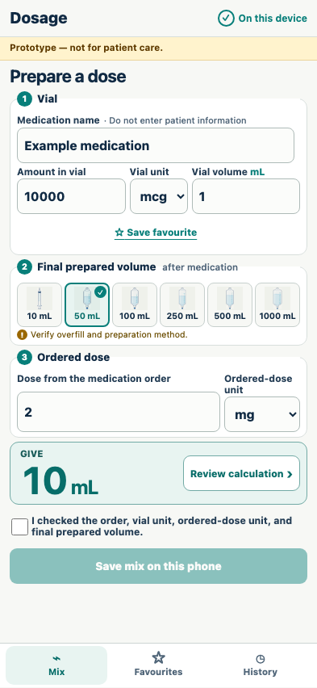

# Cross-unit calculation

A vial labelled in mg is safely reconciled with an order written in mcg.

## The common mg vial and mcg order are converted visibly

**Verifications:**

- [x] The vial is 10 mg in 1 mL
- [x] The order remains in its original 2000 mcg unit
- [x] The answer is 10 mL
- [x] KaTeX exposes vial, preparation, conversion, and administration equations

## The dimensional conversion opens as a readable, no-scroll review step

**Verifications:**

- [x] Only one focused KaTeX equation is presented at a time
- [x] The review sheet fits without horizontal or vertical scrolling

## An equivalent order in mg produces the same answer without a conversion step

**Verifications:**

- [x] 2 mg also calculates to 10 mL
- [x] Changing the unit cleared the previous 2000 mcg value before entry

## The reverse mcg-to-mg conversion is equally explicit

**Verifications:**

- [x] 10000 mcg at 2 mg calculates to 10 mL
- [x] The reverse dimensional factor is visible
