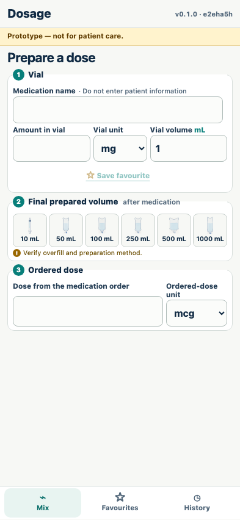

# Containers and validation

Every supported final volume calculates deterministically and invalid inputs remove the result.

## All six supported visual containers produce the expected result

**Verifications:**

- [x] Only 10, 50, 100, 250, 500, and 1000 mL are offered
- [x] The syringe image has transparent corners instead of a rectangular background
- [x] The flexible 500 mL bag is visibly wider than every other IV bag
- [x] At 1000 mL final volume the calculated volume is 200 mL

## An order exceeding the one-vial contents is blocked

**Verifications:**

- [x] The one-vial error is visible
- [x] No actionable result or save control remains

## Only mg and mcg medication units are available

**Verifications:**

- [x] Both unit selectors offer only mg and mcg
- [x] Legacy activity-unit favourites and history cannot repopulate the calculator
