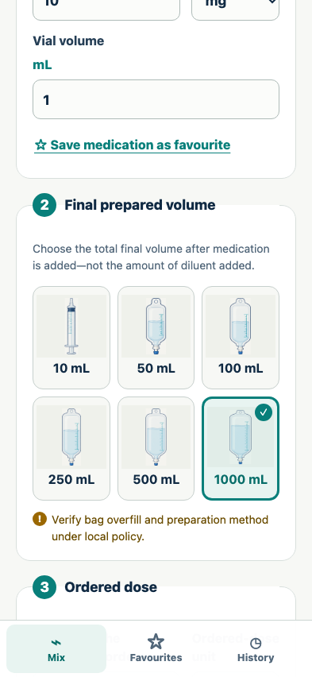
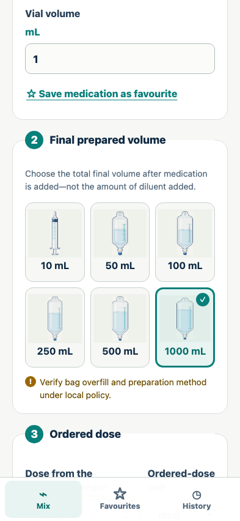
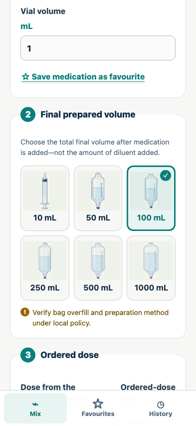

# Containers and validation

Every supported final volume calculates deterministically and invalid inputs remove the result.

## All six supported visual containers produce the expected result

**Verifications:**

- [x] Only 10, 50, 100, 250, 500, and 1000 mL are offered
- [x] At 1000 mL final volume the calculated volume is 200 mL

## An order exceeding the one-vial contents is blocked

**Verifications:**

- [x] The one-vial error is visible
- [x] No actionable result or save control remains

## Activity units stay in their own non-convertible dimension

**Verifications:**

- [x] A units-labelled vial forces the ordered unit to units
- [x] 1000 units in 100 mL for 250 units calculates to 25 mL
