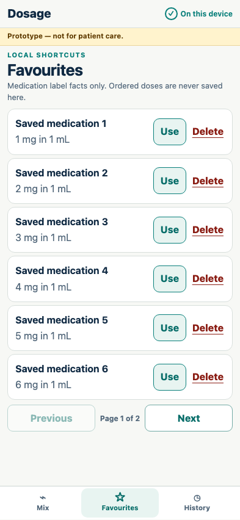

# Local favourites and history

Medication label facts can be reused, while ordered doses and confirmations must be entered again.

## The main screen marks saved vial facts with a filled favourite star

**Verifications:**

- [x] The star is filled and exposes a pressed state
- [x] The accessible label offers to remove the saved favourite

## A saved calculation reopens directly in mandatory review

**Verifications:**

- [x] The original vial and order units are preserved
- [x] The converted prepared concentration is retained
- [x] Review restores the inputs but not verification or acknowledgement

## Local records can be removed without affecting the calculator

**Verifications:**

- [x] The favourite is deleted
- [x] Mix remains available as the primary navigation destination

## A favourites page uses the available space before offering pagination

**Verifications:**

- [x] The first page shows six saved medications at once
- [x] Paging reports two pages for seven favourites
