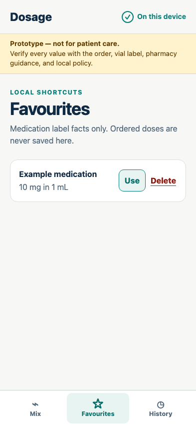
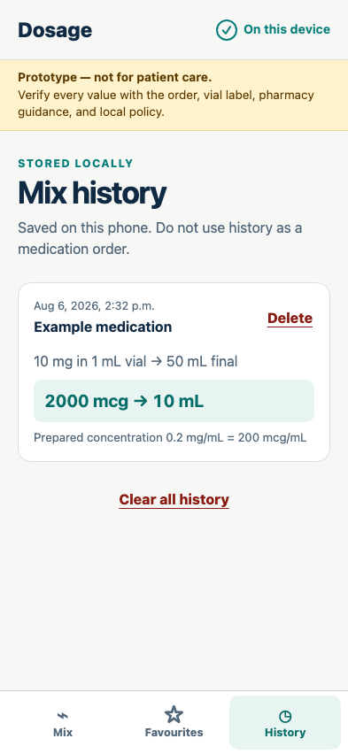
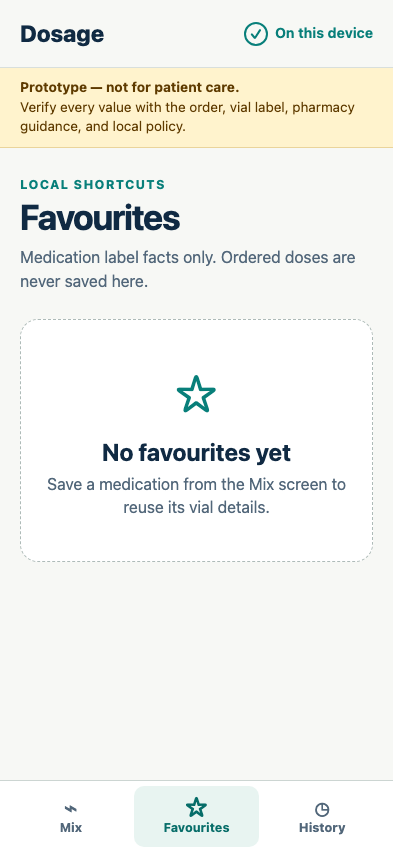

# Local favourites and history

Medication label facts can be reused, while ordered doses and confirmations must be entered again.

## A favourite stores only vial-label facts

**Verifications:**

- [x] The medication name and 10 mg in 1 mL appear
- [x] No ordered dose appears in the favourite

## An acknowledged calculation is reviewable in local history

**Verifications:**

- [x] The original vial and order units are preserved
- [x] The converted prepared concentration is retained

## Local records can be removed without affecting the calculator

**Verifications:**

- [x] The favourite is deleted
- [x] Mix remains available as the primary navigation destination
