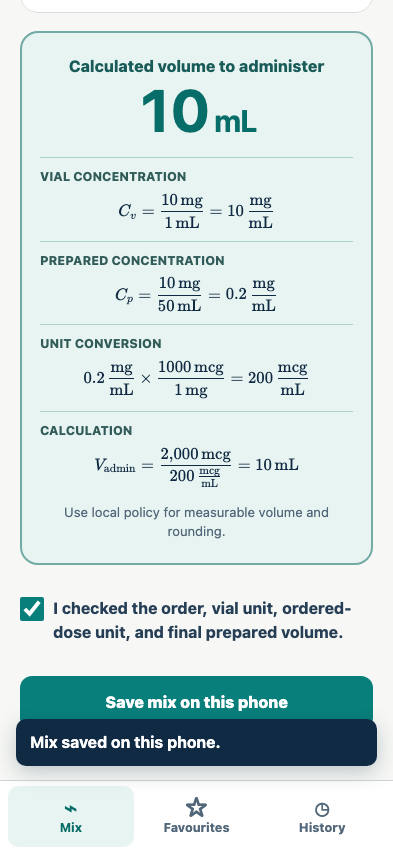
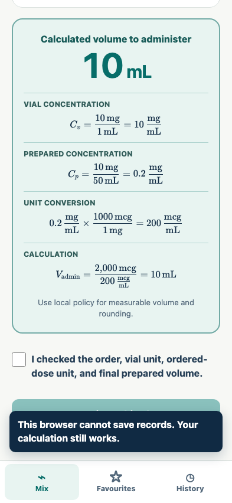

# Privacy and recovery

Calculations require no runtime service, patient field, or working persistence layer.

## Saving and calculation use only same-origin static assets and local storage

**Verifications:**

- [x] No runtime fetch, XHR, or beacon is used
- [x] Every browser request is a same-origin GET
- [x] No patient, room, order identifier, or free-text note field exists
- [x] Only versioned Dosage records are written

## A corrupt local record disables saving but never disables calculation

**Verifications:**

- [x] The 10 mL calculation remains available
- [x] The user is told that records cannot be saved
- [x] Persistence actions are disabled
