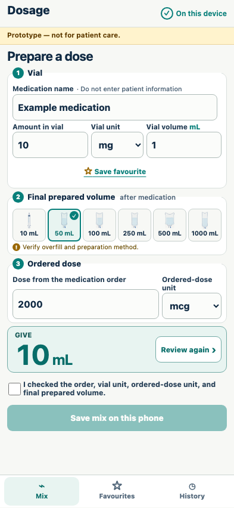

# Responsive and accessible calculation

The critical calculation remains labelled, keyboard-operable, and readable across supported viewports.

## The phone layout is operable and exposes mathematical semantics

**Verifications:**

- [x] Automated WCAG A/AA analysis reports no violations
- [x] Every critical input has an accessible label
- [x] Every screen shows the package version and source revision in the persistent header
- [x] The KaTeX rendering includes accessible MathML
- [x] Interactive controls provide at least a 44px target, excluding the checkbox inside its larger label
- [x] The page has no horizontal or vertical scrolling
